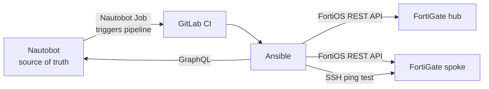

# Nautobot-driven FortiGate SD-WAN deployment

Automated deployment of a FortiGate hub-and-spoke SD-WAN (IPsec overlays + iBGP) using **Nautobot** as the source of truth, **Ansible** for configuration and **GitLab CI** for orchestration. A deployment can be started with one click from a Nautobot Job.


---

## How it works



1. All device data (interfaces, IP addresses, BGP prefixes, VDOM settings) lives in **Nautobot**.
2. A **Nautobot Job** ([nautobot-jobs](https://github.com/marekhrbac/nautobot-jobs)) triggers the GitLab pipeline and reports its result back.
3. Each playbook first loads the device data from Nautobot with a single **GraphQL** query (role `nautobot_facts`) and validates it – if anything is missing, the run stops **before** touching the firewall.
4. Ansible configures the FortiGates through the FortiOS REST API using the idempotent `fortinet.fortios` modules.
5. A post-deployment test pings from each spoke to each hub over the overlay and **fails the pipeline** if connectivity is broken.

---

## Network design

- **Hub-and-spoke SD-WAN** with two WAN underlays per site.
- **Two IPsec overlays** (one per WAN), each with a dedicated loopback used as the BGP source.
- **iBGP** (AS 65001) with the hub acting as a route reflector; spokes are accepted dynamically via `neighbor-range`, so adding a spoke requires no change on the hub.
- SD-WAN zones `underlay` and `overlay`, with firewall policies between them.
- A dedicated **testing loopback** on every device, advertised via BGP and used for end-to-end validation.

---

## Pipeline

| Stage | Playbook | Purpose |
|---|---|---|
| precheck | `test_connectivity.yml` | Nautobot data is complete, FortiGates are reachable via API |
| interfaces | `configure_interfaces_{hub,spoke}.yml` | WAN interfaces, loopbacks, zones |
| ipsec | `configure_ipsec_{hub,spoke}.yml` | IPsec phase 1 / phase 2 for both overlays |
| sdwan | `configure_sdwan_{hub,spoke}.yml` | SD-WAN members, zones and rules |
| bgp | `configure_bgp_{hub,spoke}.yml` | iBGP, route reflection, firewall policies |
| validate | `check_ping.yml` | Spoke → hub ping over the overlay |

Hubs are always configured before spokes. The pipeline runs only when started manually or triggered from Nautobot, never on a plain push.

---

## Nautobot data model

The playbooks don't contain any device-specific values – everything is read from Nautobot.

**Interfaces** are identified by tags (the interface name and IP come from Nautobot):

| Tag | Meaning |
|---|---|
| `sdwan-wan1`, `sdwan-wan2` | WAN underlay interfaces |
| `sdwan-ipsec1`, `sdwan-ipsec2` | Loopbacks used as BGP source for each overlay |
| `sdwan-testing` | Testing loopback for connectivity validation |

**Prefixes** are identified by tags as well:

| Tag | Meaning |
|---|---|
| `sdwan-ng_ipsec01_bgp`, `sdwan-ng_ipsec02_bgp` | BGP loopback ranges for each overlay (`neighbor-range` on the hub) |
| `sdwan-sub_lo_testing` | Range of testing loopbacks |

**VDOM settings** come from a config context assigned to the FortiGate platform, validated by a config context schema. Devices that differ (e.g. a multi-VDOM box) override it with local config context data:

```json
{
  "fortigate": {
    "multi_vdom": false,
    "vdom": "root"
  }
}
```

The inventory hostname must match the Device name in Nautobot.

---

## Running it locally

```bash
python3 -m venv .venv
source .venv/bin/activate
pip install ansible pynautobot netmiko
ansible-galaxy collection install -r requirements.yml

export NAUTOBOT_TOKEN=<your-token>

ansible-playbook playbooks/test_connectivity.yml --ask-vault-pass
ansible-playbook playbooks/configure_interfaces_hub.yml --ask-vault-pass
# ... remaining stages in the order shown in the pipeline table
ansible-playbook playbooks/check_ping.yml --ask-vault-pass
```

In GitLab CI, `VAULT_PASSWORD` and `NAUTOBOT_TOKEN` are provided as masked, protected CI/CD variables.

---

## Secrets

- FortiGate API tokens, SSH credentials and the IPsec pre-shared key are stored per device in `host_vars/<device>/vault.yml`, encrypted with Ansible Vault.
- The Nautobot token is read from the `NAUTOBOT_TOKEN` environment variable.

---

## Lab simplifications

This is a home lab, so some settings are intentionally relaxed and would be changed in production:

- `ansible_httpapi_validate_certs: false` and `host_key_checking = False`
- Nautobot is accessed over plain HTTP
- `configure_interfaces_*` removes all existing firewall policies to start from a clean state
- A single pre-shared key is shared by all spokes

---

## Roadmap

- [x] Nautobot as source of truth (GraphQL, tags, config contexts with schema)
- [x] GitLab CI pipeline triggered from a Nautobot Job
- [x] Data validation before deployment
- [x] Post-deployment connectivity validation that fails the pipeline
- [ ] BGP communities on spokes and SD-WAN rules on the hub steered by route tags (traffic steering per overlay)
- [ ] Support for multiple hubs (build BGP neighbor and SD-WAN member lists for all hubs in one task)
- [ ] Dry-run stage (`--check --diff`) with manual approval before deployment
- [ ] Automatic IP allocation for new spokes from Nautobot (`available-ips`)
